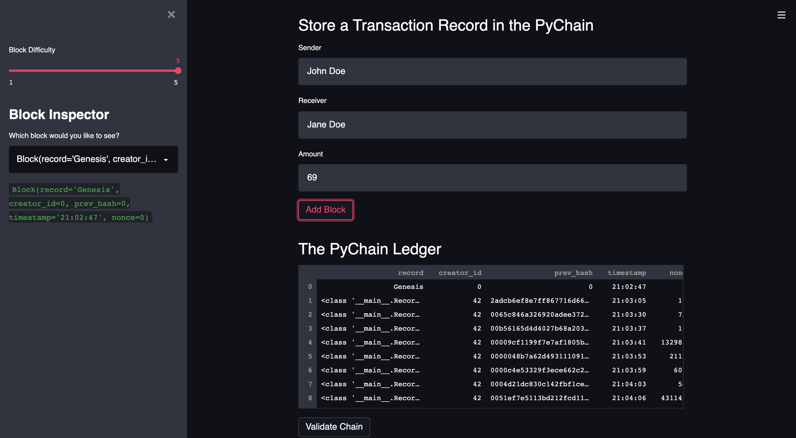
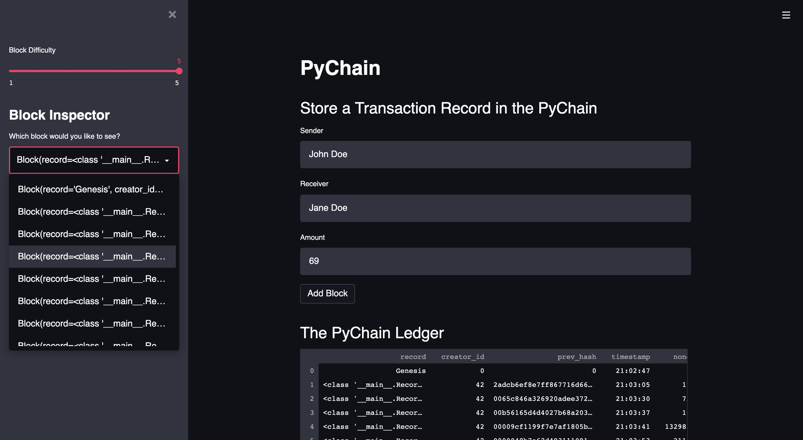
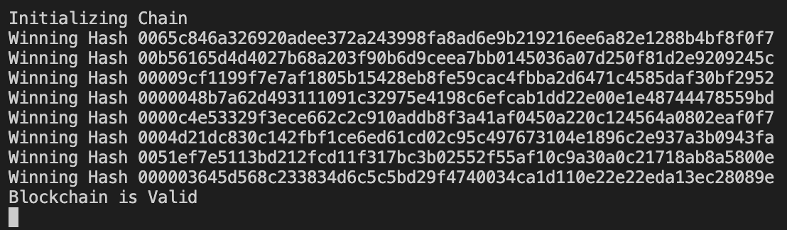

# Pychain
Pychain is a blockchain-based ledger system, complete with a user-friendly web interface. This ledger allows partner banks to conduct financial transactions (that is, to transfer money between senders and receivers) and to verify the integrity of the data in the ledger. 

---

## Technologies

This project leverages python 3.7 with the following:

* [streamlit](https://pypi.org/project/streamlit/) - Streamlit's open-source app framework is the easiest way for data scientists and machine learning engineers to create beautiful, performant apps in only a few hours!

* [datetime](https://docs.python.org/3/library/datetime.html) - Datetime supplies classes for manipulating dates and times.

* [pandas](https://github.com/pandas-dev/pandas) - Flexible and powerful data analysis / manipulation library for Python.

* [hashlib](https://pypi.org/project/hashlib/) - Hashlib provides the SHA-224, SHA-256, SHA-384, SHA-512 hash algorithms in addition to platform optimized versions of MD5 and SHA1. If OpenSSL is present all of its hash algorithms are provided.

---

### Installation Guide

Before running the application first install the following dependencies.

```python
  pip install streamlit
  pip install datetime
  pip install pandas
  pip install hashlib
```

---

## Examples

Below you will find Pychain visualizations.

### Pychain Local Deployment through Streamlit:


### Pychain Block Difficulty Slider & Block Record Inspection:


### BlockChain Initialization and Block Validation:


---

## Usage

To use the portfolio management application simply clone the repository and run the **pychain.py** with:

```python
python pychain.py

streamlit run pychain.py
```

---

## Contributors

Brought to you by Robert Giannini.
LinkedIn: https://www.linkedin.com/in/robertgianninijr/

---

## License

MIT